## [ti-re:ks] The tiny C/C++ Rx implementation
### Foreword
T_rx or tirnsr_rx is a tiny version of [ReactiveX [Rx]](http://reactivex.io/intro.html). It offers a flatmap and fluent way to combine lambdas. All memory is reserved on the stack, nothing on the heap.

This is aiming at programs that need to fit on 32kB (Ex: single Parallela core).
 
ReactiveX [Rx] is a powerful language that can change, where applicable, the way we code event based systems. It can and has been used in place of what would have been accomplished via small interpreters and/or state machines.


- [\[ti-re:ks\] The tiny C/C++ Rx implementation](#ti-reks-the-tiny-cc-rx-implementation)
  - [Foreword](#foreword)
  - [Goal](#goal)
  - [Targetted systems](#targetted-systems)
  - [Architecture](#architecture)
  - [Design decisions](#design-decisions)
  - [Demo](#demo)
  - [Development](#development)
  - [Status : in construction](#status--in-construction)
  - [Notes](#notes)
    - [uml diagram using plantuml plugin](#uml-diagram-using-plantuml-plugin)
    - [versions](#versions)
  - [design](#design)


### Goal
Having focused on small C systems for the better part of a decade, then having played with Rx.Net, I expect the following positive impact to small platform: 
1. [G1] Ease of reasoning offered by [Rx](http://reactivex.io/intro.html)
2. [G2] Freedom to compose however many operators, no price incurred by using 2 do(...) operators instead of 1 
3. [G3] Preserved performance via limited abstraction and sequence simplification
4. [G4] Light weight implementation of operators, and where not possible: it will not be implemented (go to RxCpp for that)

### Targetted systems
The project aims at small programs running on micro processors, say for instance a 16bit processor with 64KB of program space. The main behavior will remain single core and single threaded.

### Architecture
The main contribution required to make event handling palatable to small systems is a brutal shrinking of the executable. RxCpp will take most likely a minimum of 300KB for a basic implementation, for instance look at the pythagorian example. 
Here we achieve shrinking by simplifying the sequences and observables at compile time.

### Design decisions
1. minimal program size via inline, compile time simplifications
2. simplified sequences/observables are implemented in a class each, the core concept is the 'simple sequence' that is represeted by a single class. 
3. lean on the compiler and inlining to simplify successions of operators, for [G2]
2. memory management via stack and object pools, no new operator unless tied to mem pools
3. time sources handled as observables
4. disposal by getting out of scope

### Demo

the demo can run by running `./build_and_run.sh`

### Development

If you are modifying files and wanting to see in vscode terminal the results of your changes live,
run `./build_and_dev.sh` in your terminal, it will monitor changes to folders listed, and run the ```./run.sh``` script which rebuilds all, applying the preprocessing to the files ending in ```t-rx.in.cpp``` .

### Status : in construction
The pythagorian example works, the showcase does not yet.
The capture of lambdas is already done.
Work needed on observables and observers, mostly wiring, revisiting this via UML sequence diagrams. 

### Notes

#### uml diagram using plantuml plugin
it did not work for me until I installed on WSL: ```sudo apt install openjdk-21-jre-headless```
extensions used: [listed here](./.vscode/extensions.json)


#### versions
by running ```./versions.sh``` in the container as per ```./build_and_explore.sh```, here is the snapshot of the versions seen during a successful execution: 

```shell
$ g++ --version
g++ (Ubuntu 13.3.0-6ubuntu2~24.04) 13.3.0
Copyright (C) 2023 Free Software Foundation, Inc.
This is free software; see the source for copying conditions.  There is NO
warranty; not even for MERCHANTABILITY or FITNESS FOR A PARTICULAR PURPOSE.


$ python3 --version
Python 3.12.3

$ cat /etc/lsb-release
DISTRIB_ID=Ubuntu
DISTRIB_RELEASE=24.04
DISTRIB_CODENAME=noble
DISTRIB_DESCRIPTION="Ubuntu 24.04.1 LTS"

$ clang-format --version
Ubuntu clang-format version 18.1.3 (1ubuntu1)
```


### design

```C
  {
      auto c0= &c;
      sequence seq14 = [c0] => fromRange<unsigned>(1,999)
          select z1 => struct {z = z1, c = c0}
          selectmany 1, [azc] => fromRange<unsigned>(1, azc.z)
                  select x => struct {z = azc.z, x = x, c = azc.c}
                  selectmany 1, [azcx] => fromRange<unsigned>(azcx.x, azcx.z)
                        where  y => { (*azcx.c)++; return azcx.x*azcx.x + y*y == azcx.z*azcx.z; }
                        select y => struct {x = azcx.x, y =y , z= azcx.z}
                        do     a => std::cout << " values: xx: " << a.x << ", yy:" <<a.y << ", zz:" << a.z <<'\n'
                        endObservable
                  endObservable
          select a => a.z
          take 100
          endObservable
          ;

      seq14.subscribe(&n_trace, &c_trace, nullptr);
      if (DEBUG) std::cout << "\nready to go, enable: \n" << std::flush;
      seq14.enable(c0);
      seq14.disable();
  }
```
TBD: explain distinction transform_complete2 transform_complete2_

```plantuml
@startuml lifecycle of captured variables
' START stack items definitions, from pythagorian.t-rx.out.hpp
' from interior to exterior
participant stack

participant seq14_2_sequence2_array.n [
  = seq14_2_sequence2_array.n
  ----
  is std::array<subsequence>
  ----
  __is rx_usable()__
  + bool enabled
  + constr() => enabled =false;
  ----
  __is observable(seq_14_manager2)__
  - exit_next
  - exit complete
  + void* exit_obj
  + void subscribe(exit_next,exit_complete,exit_obj)
  + void direct_exit_next( d)
  ----
  - auto capture _c0 
  - auto union _exchange
  - receive_next
  - count
  generate:
  (...)
  + bool enable(c0)
  + void disable
  + constructor => func_init_higher_order 
  + destructor => disable
]
participant seq14_2_sequence2_array [
  = seq14_2_sequence2_array
  ----
  is std::array<subsequence>
]

participant seq_14_2_manager2 [
  = seq_14_2_manager2
  ----
  is high_order_manager(sequence_array)
  ----
  + constructor
  + bind
  + unbind
  + assign_work
]
participant seq14_sequence2_array.n [
  = seq14_sequence2_array.n
  ----
  is std::array<subsequence>
  ----
  __is rx_usable()__
  + bool enabled
  + constr() => enabled =false;
  ----
  __is observable(seq_14_manager2)__
  - exit_next
  - exit complete
  + void* exit_obj
  + void subscribe(exit_next,exit_complete,exit_obj)
  + void direct_exit_next( d)
  ----
  - auto capture _c0 
  - auto union _exchange
  - receive_next
  - count
  generate:
  (...)
  + bool enable(c0)
  + void disable
  + constructor => func_init_higher_order 
  + destructor => disable
]
participant seq14_sequence2_array [
  = seq14_sequence2_array
  ----
  is std::array<subsequence>
]
participant seq_14_manager2 [
  = seq_14_manager2
  ----
  is high_order_manager(sequence_array)
  ----
  + constructor
  + bind 
  + unbind
  + assign_work
]
participant seq14_sub [
  = seq14_sub
  ----
  __is rx_usable()__
  + bool enabled
  + constr() => enabled =false;
  ----
  __is observable(seq_14_manager2)__
  - exit_next
  - exit complete
  + void* exit_obj
  + void subscribe(exit_next,exit_complete,exit_obj)
  + void direct_exit_next( d)
  ----
  - auto capture _c0 
  - auto union _exchange
  - receive_next
  - count
  generate:
  - transform_next0 ()
  - transform_complete0()
  - transform_next1 ()
  - transform_complete1 = push next
  for selectmany:
  - counter2 (not init!?!?)
   

  + bool enable(c0)
  + void disable
  + constructor => func_init_higher_order 
  + destructor => disable
]
' END stack items definitions

' START stack usage section, from pythagorian.t-rx.out.hpp
' from interior to exterior
stack->stack: stack reservations \nat declaration

stack -> seq14_2_sequence2_array.n : create (seq_14_2_manager2)
activate stack #AAAAAA
activate seq14_2_sequence2_array.n #FFBBBB
seq14_2_sequence2_array.n -> seq14_2_sequence2_array.n : __func_init_higher_order__:\n    count =0 
activate seq14_2_sequence2_array.n #FF4444
seq14_2_sequence2_array.n -> seq14_2_sequence2_array.n : NO bind
deactivate seq14_2_sequence2_array.n
seq14_2_sequence2_array.n -> stack
deactivate seq14_2_sequence2_array.n

stack -> seq14_2_sequence2_array : create (seq14_2_sequence2_array.n)\noutside manager\nso that is on the stack at top level\nof declaring function
activate stack #AAAAAA

stack -> seq_14_2_manager2 : create (seq14_sequence2_array.n)
activate stack #AAAAAA

stack -> seq14_sequence2_array.n : create (seq_14_2_manager2)
activate stack #AAAAAA
activate seq14_sequence2_array.n #FFBBBB
seq14_sequence2_array.n -> seq14_sequence2_array.n : __func_init_higher_order__:\n    count =0 
activate seq14_sequence2_array.n #FF4444
seq14_sequence2_array.n -> seq_14_2_manager2 : bind (this.receive_next, this.receive_complete, this)
seq_14_2_manager2 -> seq14_sequence2_array.n
deactivate seq14_sequence2_array.n
seq14_sequence2_array.n -> stack
deactivate seq14_sequence2_array.n

stack -> seq14_sequence2_array : create (seq14_sequence2_array.n)\noutside manager\nso that is on the stack at top level\nof declaring function
activate stack #AAAAAA


stack -> seq_14_manager2 : create (seq14_sequence2_array.n)
activate stack #AAAAAA
stack -> seq14_sub : create (seq_14_manager2)
activate stack #AAAAAA
activate seq14_sub #FFBBBB
seq14_sub -> seq14_sub : __func_init_higher_order__:\n    count =0 
activate seq14_sub #FF4444
seq14_sub -> seq_14_manager2 : bind (this.receive_next, this.receive_complete, this)
seq_14_manager2 -> seq14_sub
deactivate seq14_sub
seq14_sub -> stack
deactivate seq14_sub
' END stack usage section

' START usage section, from pythagorian.t-rx.out.cpp
' from interior to exterior staying within for immediate action
activate stack #00FF00
stack -> seq14_sub : (&n_trace, &c_trace, nullptr)

stack -> seq14_sub : enable(c0)
seq14_sub -> seq14_sub : set enabled = true
seq14_sub -> seq14_sub : set capture value passed as arg
seq14_sub -> seq14_sub : try an external provider \n(nothing in fromconnect would pull \nfrom a buffer)
' note that for background task to try later, would be best to hit fromconnect as long as enabled, and avoid set enabled and set capture.
seq14_sub -> seq14_sub : for loop logic starts\npushing integers to transform_next1
seq14_sub -> seq14_sub : select logic\n transform_next1 applies seq14_fs1\n z1 => struct {z = z1, c = c0}
activate seq14_sub
seq14_sub -> seq14_sub : selectmany logic\n try to assign work to subsequence
seq14_sub -> seq_14_manager2 : success =assignwork(for_capture, this)

seq_14_manager2 -> seq14_sequence2_array : get iterator => foreach element
seq_14_manager2 -> seq_14_manager2 : if element.enabled==false, then
seq_14_manager2 -> seq14_sequence2_array.n : element.exit_obj=caller
'note: should above be passed in enabler?
seq_14_manager2 -> seq14_sequence2_array.n : ret = enable(captured)
seq14_sequence2_array.n -> seq14_sequence2_array.n : same logic
'same logic within for seq14_sequence2_array.n.enable,
' and again within 
seq14_sequence2_array.n -> seq14_sub : static receive_next(v2, self) { self->state=v2;}
seq14_sub -> seq14_sub : select logic\n transform_next3 applies seq14_fs3\n a => a.z
seq14_sub -> seq14_sub : take logic\n x=> { counter4++; &n_trace(x); if (counter4 >=  100) {stop()}
seq14_sub -> seq14_sub : stop: oncomplete => dispose
activate seq14_sub
seq14_sub -> seq14_sub : disable();
activate seq14_sub
seq14_sub -> seq14_sub : enable = false;
seq14_sub -> seq14_sub : enable = false;
seq14_sub -> seq_14_manager2 : disableFrom(this)
seq_14_manager2 -> seq14_sequence2_array : get iterator\nforeach element
seq_14_manager2 -> seq14_sequence2_array.n : if (element.exitObject == caller)
seq_14_manager2 -> seq14_sequence2_array.n : element.disable()
seq_14_manager2 -> seq14_sub
deactivate seq14_sub
deactivate seq14_sub

seq14_sub -> seq14_sub
seq14_sub -> seq14_sequence2_array.n
seq14_sequence2_array.n -> seq_14_manager2: return true
' need o revisit the dispose() story. is the completed from top observable propagating down: .
' transform_next2 probably needs to call transform_complete2() if !this->enabled,
'  transform_complete2 should call manager.unbind ()
' transform_next4 should have a bool to prevent a double transform_complete4
' transform_complete4() to call transform_complete5()


seq_14_manager2 -> seq14_sub : return ret or 'no element => false'

' seems below is for tracing?
seq14_sub -> seq14_sub : if success counter2++
seq14_sub -> stack 
deactivate seq14_sub

stack -> seq14_sub : disable() // already done - not drawing again

stack -> stack : out of scope => stack cleanup
deactivate stack
deactivate stack
deactivate stack
deactivate stack
deactivate stack
deactivate stack
deactivate stack
deactivate stack
@enduml

```



markdown-preview-enhanced.plantumlJarPath .vscode-server/extensions/jebbs.plantuml-2.18.1/plantuml.jar