```plantuml
@startuml lifecycle of captured variables
' START stack items definitions, from pythagorian.t-rx.out.hpp
' from interior to exterior
participant stack

participant seq14_2_sequence2_array.n [
  = seq14_2_sequence2_array.n
  ----
  is std::array<subsequence>
  ----
  __is rx_usable()__
  + bool enabled
  + constr() => enabled =false;
  ----
  __is observable(seq14_sub)__
  - exit_next
  - exit complete
  + void* exit_obj
  + void subscribe(exit_next,exit_complete,exit_obj)
  + void direct_exit_next( d)
  ----
  - auto capture _c0 
  - auto union _exchange
  - receive_next
  - count
  generate:
  (...)
  + bool enable(c0)
  + void disable
  + constructor => func_init_higher_order 
  + destructor => disable
]
participant seq14_2_sequence2_array [
  = seq14_2_sequence2_array
  ----
  is std::array<subsequence>
]

participant seq14_sequence2_array.n [
  = seq14_sequence2_array.n
  ----
  is high_order_manager(sequence_array)
  ----
  + constructor
  + bind
  + unbind
  + assign_work
]
participant seq14_sequence2_array.n [
  = seq14_sequence2_array.n
  ----
  is std::array<subsequence>
  ----
  __is rx_usable()__
  + bool enabled
  + constr() => enabled =false;
  ----
  __is observable(seq14_sub)__
  - exit_next
  - exit complete
  + void* exit_obj
  + void subscribe(exit_next,exit_complete,exit_obj)
  + void direct_exit_next( d)
  ----
  - auto capture _c0 
  - auto union _exchange
  - receive_next
  - count
  generate:
  (...)
  + bool enable(c0)
  + void disable
  + constructor => func_init_higher_order 
  + destructor => disable
]
participant seq14_sequence2_array [
  = seq14_sequence2_array
  ----
  is std::array<subsequence>
]
participant seq14_sub [
  = seq14_sub
  ----
  + bind 
  + unbind
  + assign_work
  ----
  __is rx_usable()__
  + bool enabled
  + constr() => enabled =false;
  ----
  __is observable(seq14_sub)__
  - exit_next
  - exit complete
  + void* exit_obj
  + void subscribe(exit_next,exit_complete,exit_obj)
  + void direct_exit_next( d)
  ----
  - auto capture _c0 
  - auto union _exchange
  - receive_next
  - count
  generate:
  - transform_next0 ()
  - transform_complete0()
  - transform_next1 ()
  - transform_complete1 = push next
  for selectmany:
  - counter2 (not init!?!?)
   

  + bool enable(c0)
  + void disable
  + constructor => func_init_higher_order 
  + destructor => disable
]
' END stack items definitions

' START stack usage section, from pythagorian.t-rx.out.hpp
' from interior to exterior
stack->stack: stack reservations \nat declaration

stack -> seq14_2_sequence2_array.n : create (seq14_sequence2_array.n)
activate stack #AAAAAA
activate seq14_2_sequence2_array.n #FFBBBB
seq14_2_sequence2_array.n -> seq14_2_sequence2_array.n : __func_init_higher_order__:\n    count =0 
activate seq14_2_sequence2_array.n #FF4444
seq14_2_sequence2_array.n -> seq14_2_sequence2_array.n : NO bind
deactivate seq14_2_sequence2_array.n
seq14_2_sequence2_array.n -> stack
deactivate seq14_2_sequence2_array.n

stack -> seq14_2_sequence2_array : create (seq14_2_sequence2_array.n)\noutside sequence\nso that is on the stack at top level\nof declaring function
activate stack #AAAAAA

stack -> seq14_sequence2_array.n : create (seq14_sequence2_array.n)
activate stack #AAAAAA
activate seq14_sequence2_array.n #FFBBBB
seq14_sequence2_array.n -> seq14_sequence2_array.n : __func_init_higher_order__:\n    count =0 
activate seq14_sequence2_array.n #FF4444
seq14_sequence2_array.n -> seq14_sequence2_array.n : bind (this.receive_next, this.receive_complete, this)
seq14_sequence2_array.n -> seq14_sequence2_array.n
deactivate seq14_sequence2_array.n
seq14_sequence2_array.n -> stack
deactivate seq14_sequence2_array.n

stack -> seq14_sequence2_array : create (seq14_sequence2_array.n)\noutside sequence\nso that is on the stack at top level\nof declaring function
activate stack #AAAAAA


stack -> seq14_sub : create (seq14_sequence2_array.n)
activate stack #AAAAAA
activate seq14_sub #FFBBBB
seq14_sub -> seq14_sub : __func_init_higher_order__:\n    count =0 
activate seq14_sub #FF4444
seq14_sub -> seq14_sub : bind (this.receive_next, this.receive_complete, this)
seq14_sub -> seq14_sub
deactivate seq14_sub
seq14_sub -> stack
deactivate seq14_sub
' END stack usage section

' START usage section, from pythagorian.t-rx.out.cpp
' from interior to exterior staying within for immediate action
activate stack #00FF00
stack -> seq14_sub : (&n_trace, &c_trace, nullptr)

stack -> seq14_sub : enable(c0)
seq14_sub -> seq14_sub : set enabled = true
seq14_sub -> seq14_sub : set capture value passed as arg
seq14_sub -> seq14_sub : try an external provider \n(nothing in fromconnect would pull \nfrom a buffer)
' note that for background task to try later, would be best to hit fromconnect as long as enabled, and avoid set enabled and set capture.
seq14_sub -> seq14_sub : for loop logic starts\npushing integers to transform_next1
seq14_sub -> seq14_sub : select logic\n transform_next1 applies seq14_fs1\n z1 => struct {z = z1, c = c0}
activate seq14_sub
seq14_sub -> seq14_sub : selectmany logic\n try to assign work to subsequence
seq14_sub -> seq14_sub : success =assignwork(for_capture, this)

seq14_sub -> seq14_sequence2_array : get iterator => foreach element
seq14_sub -> seq14_sub : if element.enabled==false, then
seq14_sub -> seq14_sequence2_array.n : element.exit_obj=caller
'note: should above be passed in enabler?
seq14_sub -> seq14_sequence2_array.n : ret = enable(captured)
seq14_sequence2_array.n -> seq14_sequence2_array.n : same logic
'same logic within for seq14_sequence2_array.n.enable,
' and again within 
seq14_sequence2_array.n -> seq14_sub : static receive_next(v2, self) { self->state=v2;}
seq14_sub -> seq14_sub : select logic\n transform_next3 applies seq14_fs3\n a => a.z
seq14_sub -> seq14_sub : take logic\n x=> { counter4++; &n_trace(x); if (counter4 >=  100) {stop()}
seq14_sub -> seq14_sub : stop: oncomplete => dispose
activate seq14_sub
seq14_sub -> seq14_sub : disable();
activate seq14_sub
seq14_sub -> seq14_sub : enable = false;
seq14_sub -> seq14_sub : enable = false;
seq14_sub -> seq14_sub : disableFrom(this)
seq14_sub -> seq14_sequence2_array : get iterator\nforeach element
seq14_sub -> seq14_sequence2_array.n : if (element.exitObject == caller)
seq14_sub -> seq14_sequence2_array.n : element.disable()
seq14_sub -> seq14_sub
deactivate seq14_sub
deactivate seq14_sub

seq14_sub -> seq14_sub
seq14_sub -> seq14_sequence2_array.n
seq14_sequence2_array.n -> seq14_sub: return true
' need o revisit the dispose() story. is the completed from top observable propagating down: .
' transform_next2 probably needs to call transform_complete2() if !this->enabled,
'  transform_complete2 should call manager.unbind ()
' transform_next4 should have a bool to prevent a double transform_complete4
' transform_complete4() to call transform_complete5()


seq14_sub -> seq14_sub : return ret or 'no element => false'

' seems below is for tracing?
seq14_sub -> seq14_sub : if success counter2++
seq14_sub -> stack 
deactivate seq14_sub

stack -> seq14_sub : disable() // already done - not drawing again

stack -> stack : out of scope => stack cleanup
deactivate stack
deactivate stack
deactivate stack
deactivate stack
deactivate stack
deactivate stack
deactivate stack
deactivate stack
@enduml

```

## [ti-re:ks] The tiny C/C++ Rx implementation
### Foreword
T_rx or tirnsr_rx is a tiny version of [ReactiveX [Rx]](http://reactivex.io/intro.html). It offers a flatmap and fluent way to combine lambdas. All memory is reserved on the stack, nothing on the heap.

This is aiming at programs that need to fit on 32kB (Ex: single Parallela core).
 
ReactiveX [Rx] is a powerful language that can change, where applicable, the way we code event based systems. It can and has been used in place of what would have been accomplished via small interpreters and/or state machines.


- [\[ti-re:ks\] The tiny C/C++ Rx implementation](#ti-reks-the-tiny-cc-rx-implementation)
  - [Foreword](#foreword)
  - [Goal](#goal)
  - [Targetted systems](#targetted-systems)
  - [Architecture](#architecture)
  - [Design decisions](#design-decisions)
  - [Demo](#demo)
  - [Development](#development)
  - [Status : in construction](#status--in-construction)
  - [Notes](#notes)
    - [uml diagram using plantuml plugin](#uml-diagram-using-plantuml-plugin)
    - [tooling versions](#tooling-versions)
  - [contribute](#contribute)
  - [release notes](#release-notes)
  - [coming next](#coming-next)
  - [design](#design)


### Goal
Having focused on small C systems for the better part of a decade, then having played with Rx.Net, I expect the following positive impact to small platform: 
1. [G1] Ease of reasoning offered by [Rx](http://reactivex.io/intro.html)
2. [G2] Freedom to compose however many operators, no price incurred by using 2 do(...) operators instead of 1 
3. [G3] Preserved performance via limited abstraction and sequence simplification
4. [G4] Light weight implementation of operators, and where not possible: it will not be implemented (go to RxCpp for that)

### Targetted systems
The project aims at small programs running on micro processors, say for instance a 16bit processor with 64KB of program space. The main behavior will remain single core and single threaded.

### Architecture
The main contribution required to make event handling palatable to small systems is a brutal shrinking of the executable. RxCpp will take most likely a minimum of 300KB for a basic implementation, for instance look at the pythagorian example. 
Here we achieve shrinking by simplifying the sequences and observables at compile time.

### Design decisions
1. minimal program size via inline, compile time simplifications
2. simplified sequences/observables are implemented in a class each, the core concept is the 'simple sequence' that is represeted by a single class. 
3. lean on the compiler and inlining to simplify successions of operators, for [G2]
2. memory management via stack and object pools, no new operator unless tied to mem pools
3. time sources handled as observables
4. disposal by getting out of scope

### Demo

the demo can run by running `./build_and_run.sh`

### Development

If you are modifying files and wanting to see in vscode terminal the results of your changes live,
run `./build_and_dev.sh` in your terminal, it will monitor changes to folders listed, and run the ```./run.sh``` script which rebuilds all, applying the preprocessing to the files ending in ```t-rx.in.cpp``` .

### Status : in construction
The pythagorian example works, the showcase does not yet.
The capture of lambdas is already done.
Work needed on observables and observers, mostly wiring, revisiting this via UML sequence diagrams. 

### Notes

#### uml diagram using plantuml plugin
it did not work for me until I installed on WSL: ```sudo apt install openjdk-21-jre-headless```
extensions used: [listed here](./.vscode/extensions.json)


#### tooling versions
by running ```./versions.sh``` in the container as per ```./build_and_explore.sh```, here is the snapshot of the versions seen during a successful execution: 

```shell
$ g++ --version
g++ (Ubuntu 13.3.0-6ubuntu2~24.04) 13.3.0
Copyright (C) 2023 Free Software Foundation, Inc.
This is free software; see the source for copying conditions.  There is NO
warranty; not even for MERCHANTABILITY or FITNESS FOR A PARTICULAR PURPOSE.


$ python3 --version
Python 3.12.3

$ cat /etc/lsb-release
DISTRIB_ID=Ubuntu
DISTRIB_RELEASE=24.04
DISTRIB_CODENAME=noble
DISTRIB_DESCRIPTION="Ubuntu 24.04.1 LTS"

$ clang-format --version
Ubuntu clang-format version 18.1.3 (1ubuntu1)
```

### contribute

So far this is a solo POC, but I am open to suggestions. I believe the parsing approach with regex is flawed and constraining, but workable. For now learning is the main objective, with great results and coverage.

Here is an intersting website for working on the parser with regex, and expecially captures: https://regex101.com/r/D5mUTo/1


### release notes
- v0.1 - the original design has the following decomposition of features:
  - sequence class that
    - concatenates most of the operators using a union variable to hold the transformed values over time
    - branches out values to sub sequences as needed for selectmany (aka flatmap)
  - foreach selectmany operator, a manager class that handles a pool (std::array) of sub-sequences
    - binds the sub- sequences to the main sequence, and also
    - initiates immediate inits with assign_work
    - ultimately disposes (aka disables in the case of the pool approach) the sub
- v0.2 - optimization , this version now merges the managers within the sequence owning the corresponding selectmany logic
  - this reduces the number of indirections
    - seen by smaller binary:
    >-rwxr-xr-x 1 root   root   18840 Jan 16 23:28 pythagorian.exe.original
    -rwxr-xr-x 1 root   root   18592 Jan 16 23:27 pythagorian.exe.merge_binding_to_sequence  
    - we can see that ~250 bytes are spared by this, explained by more inlining
  - note that it is possible to abstract more parts of the system to have a manager that is more generic, and therefore reusable when the templates are redundant
    - this is no likely though, and still requires more execution
-  v0.3
   -  scan opertor using simple ints on capture no issue, but limited use when nested in selectmany
   -  scan using accumulator pool, issue passing the pool via capture
      -  the anonymous struct approach leads to union issue due to non-trivial constructors
      -  call for passing the pools explicitely, which should not be too hard, like selectmany
      -  partial implementation (not compiling yet) with capture of array of accumulators, missing the init of the array of sequences

### coming next
- [ON HOLD]: gcc13.1+
  -  I have a gcc rebuild branch, but will stop users given the time it takes
  - nice to have for std support of typles etc..
- user ease of adoption
  - attempt to map debugging experience running on the transformed files back to displaying the original file
    - need to modify the symbols ?
  - color coding of sequence
    - put the sequence in a comment to avoid intellisense ?
      - example off [better-comments](https://github.com/aaron-bond/better-comments/blob/master/src/extension.ts) extension plugin for vscode 
      - use cpp related syntac from [better-cpp](https://github.com/jeff-hykin/better-cpp-syntax/blob/master/autogenerated/cpp.tmLanguage.json) ?
      - use an anchors like markdown's \`\`\`C  .... \`\`\`
      - new anchor \`\`\`seq
- use google test for tests, and google benchmark
  - use test maste
  - generate benchmarks for alternatives of implementation


### design

```C
  {
      auto c0= &c;
      sequence seq14 = [c0] => fromRange<unsigned>(1,999)
          select z1 => struct {z = z1, c = c0}
          selectmany 1, [azc] => fromRange<unsigned>(1, azc.z)
                  select x => struct {z = azc.z, x = x, c = azc.c}
                  selectmany 1, [azcx] => fromRange<unsigned>(azcx.x, azcx.z)
                        where  y => { (*azcx.c)++; return azcx.x*azcx.x + y*y == azcx.z*azcx.z; }
                        select y => struct {x = azcx.x, y =y , z= azcx.z}
                        do     a => std::cout << " values: xx: " << a.x << ", yy:" <<a.y << ", zz:" << a.z <<'\n'
                        endObservable
                  endObservable
          select a => a.z
          take 100
          endObservable
          ;

      seq14.subscribe(&n_trace, &c_trace, nullptr);
      if (DEBUG) std::cout << "\nready to go, enable: \n" << std::flush;
      seq14.enable(c0);
      seq14.disable();
  }
```


